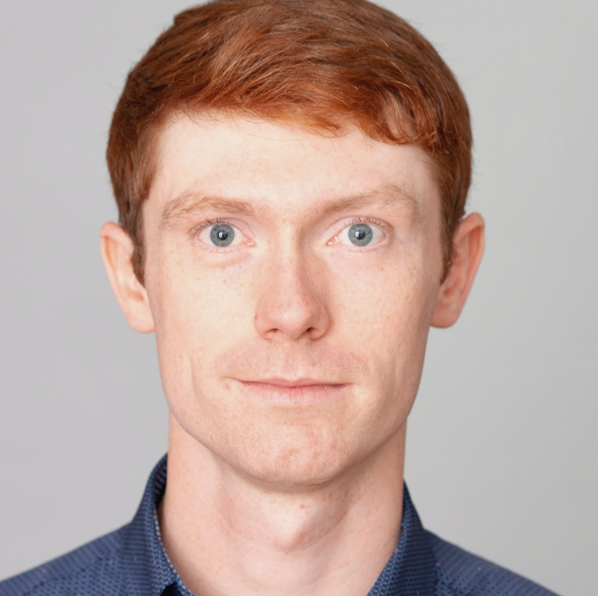

<!--div class="staffer">
  
  

    <h3 class="staffer-name">
      <a href="{{ staff_website }}" target="_blank">{{ staff_name }}</a>
      
<b>{{ staff_pronouns }}</b>

    </h3>
    
<a href="mailto:{{ staff_email }}">{{ staff_email }}</a>

    
<b>Office Hours:</b> {{ staff_oh }}

  

</div-->

::::{grid} 1 2 2 2

:::{card}
:header: **Alexander Strang**

+++

* **Office Hours**: Tues. 1:00 - 2:00 pm, Fri. 2:00 - 3:00 pm. (Evans 305)
* **Pronouns**: He/Him
* [alexstrang@berkeley.edu](mailto:alexstrang@berkeley.edu)
:::

:::{card}
:header: **Zhexiao Lin**

+++

* **Office Hours**: W 10-11 am (Evans 334), 3:00 - 4:00 pm (Evans 446).
* **Pronouns**: He/Him
* [zhexiaolin@berkeley.edu](mailto:zhexiaolin@berkeley.edu)

:::

::::

:::{attention} Welcome to [Week 11](#week11) of Stat 238!
:class: dropdown
:icon: false
👋
:::

# Schedule

:::{schedule} ./schedule.yml

:::
